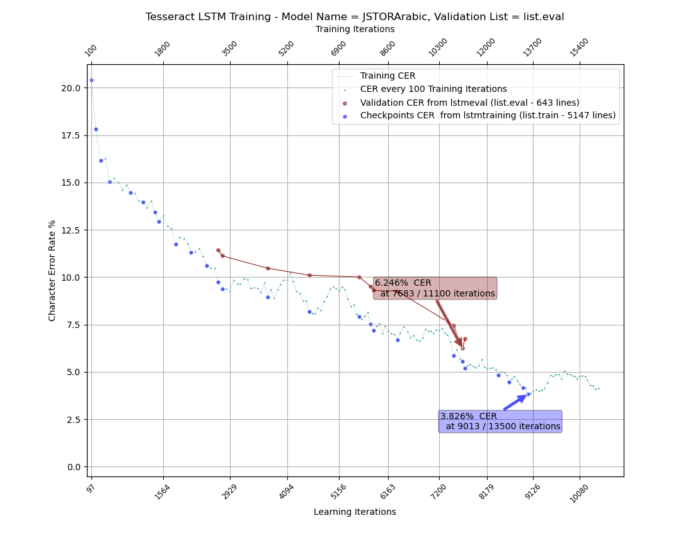

# tesstrain-JSTORArabic

Training workflow for Tesseract 5 for JSTORArabic

## tesstrain
https://github.com/tesseract-ocr/tesstrain

## JSTORArabic Training Data
https://github.com/OpenITI/TrainingData/tree/master/JSTORArabic

## Setup
setup.sh

## Training
train.sh

## Plotting
cd plot
make MODEL_NAME=JSTORArabic
make MODEL_NAME=JSTORArabic VALIDATE_LIST=eval

The plots are saved in [data/JSTORArabic/plot](data/JSTORArabic/plot)

